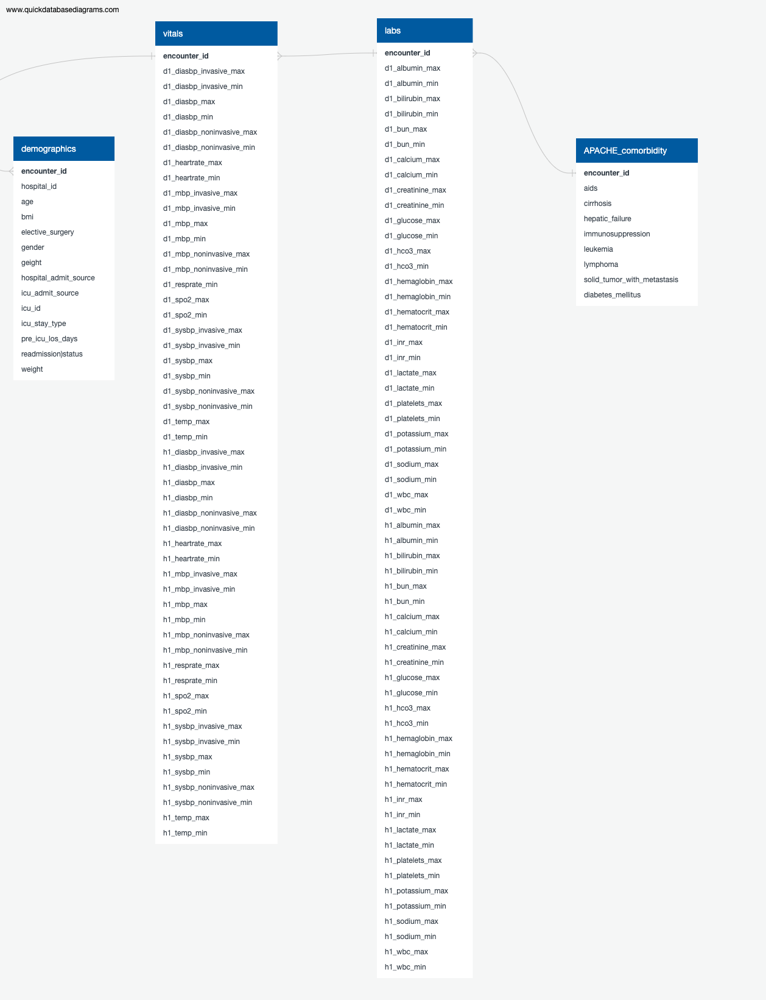
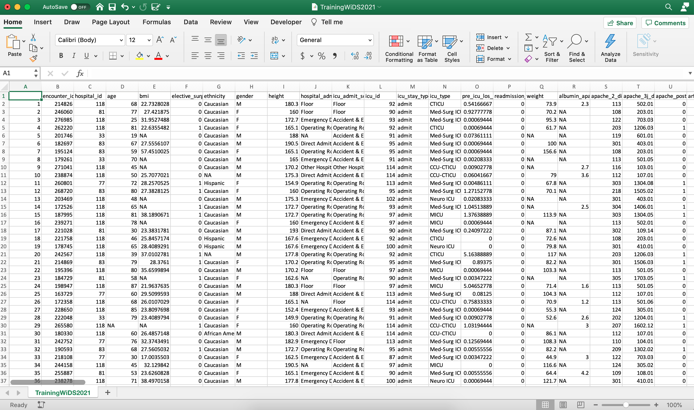

# Diabetes Predictions in ICUs

## Topic:
To determine whether a patient admitted to an ICU has been diagnosed with a particular type of diabetes, Diabetes Mellitus using data from the first 24 hours of intensive care.

## Reason Selecting Topic:
We came across the WiDS Datathon, which stands for Women in Data Science Datathon. They strive to inspire women worldwide to learn more about data science and provide a platform for women to connect and share their interests in a supportive community.

This year, they are focusing on patient health with the chronic condition of diabetes. They are doing this challenge to predict if a patient admitted to an ICU has been diagnosed with Diabetes Mellitus. The Intensive Care Units (ICUs) need the medical histories for incoming patients to give the right treatment, and an unconscious patient may not be able to provide such information. 

We decided to take on this project from [Kaggle](https://www.kaggle.com/c/widsdatathon2021/).

## Description of Data Sources: 
Data Source:
- TrainingWiDS2021.csv
- DataDictionaryWiDS2021.csv 
- APACHE_comorbidity.csv
- demographics.csv
- labs.csv
- vitals.csv

For this analysis, we used the TrainingWiDS2021.csv and the DataDictionaryWiDS2021.csv from the WiDS Datathon dataset. 

We used TrainingWiDS2021.csv to populate the database and DataDictionaryWiDS2021.csv for the description of information about the data. 

We sorted the TrainingWiDS2021.csv into 4 other dataset into APACHE_comorbidity.csv, demographics.csv, labs.csv, and vitals.csv. 

The APACHE_comorbidity.csv contains data of the APACHE comorbidity. 

The demographics.csv contains the demographics of the patient. 

The labs.csv contains the data of the lab results and the vitals.csv contains the data of the patient's vitals.

Software: 
- Python 3.9
- Jupyter Notebook 6.1.4
- SQLiteStudio
- Tableau

## Hypothesis:
Null Hypothesis: Patients admitted to an ICU has been diagnosed with Diabetes Mellitus.

Alternative Hypothesis: Patients admitted to an ICU has not been diagnosed with Diabetes Mellitus.

## Questions they hope to answer with the data:
- What are some criteria to diagnose patients with Type 2 Diabetes Mellitus?
- Whether we can construct a script that suffices to predict who will, under these same circumstances, have diabetes.

## Database:

 After deciding on the features to use, we selected the relevant data from the Kaggle dataset to create a static sqlite database file using SQLite Studio. 

 Four tables were identified based on the categories in the data dictionary file (demographics, vitals, labs and Apache comorbidity).  

 An ERD (diabetes_db_erd.png) was created initially to view the database schema. 

 

 The data from the original dataset was split into four csv files to load to the tables. 

 

 The tables are joined via the unique Encounter_ID column as the primary key, included in the query.sql file. 
 
 The database is connected to the model using SQLAlchemy.

## Machine Learning Model:

### Description of preliminary data preprocessing. 
The dataset has a total of 180 columns and 130,157 rows. Many of the values are missing or filled with NA. We decided to remove all missing values and be left with a dataset that is a little smaller. The cleaned dataset will have all values of the features to successfully train and test the models. 

### Description of preliminary feature engineering and preliminary feature selection, including their decision-making process. 
Through our research, we were able to see the major risk factors of Diabetes Mellitus which include family history, being overweight, physical inactivity, age, ethnicity, high blood pressure, impaired glucose tolerance. To find the corresponding variables in the dataset, we have chosen 'age', 'bmi', 'ethnicity', 'gender', 'height', 'weight', 'd1_glucose_max', 'd1_mbp_max' to be the features. In addition to finding out whether a patient in the ICU might have diabetes mellitus, we included features of comorbidity. This is the simultaneous presence of two or more diseases or medical conditions in a patient. These features are included in our dataset as 'aids', 'cirrhosis', 'hepatic_failure', 'immunosuppression', 'leukemia', 'lymphoma', and 'solid_tumor_with_metastasis'.

### Description of how data was split into training and testing sets. 
Dataset is split into 75% training and 25% testing. 

### Explanation of model choice, including limitations and benefits.
Since our main goal is to classify a patient with diabetes mellitus or no diabetes mellitus, the initial approach was a mock model with Logistic Regression. After splitting the dataset into 75% training and 25% testing, the accuracy score is 78.8%. Then we tested the dataset with a decision tree model and the random forest model. Both models earned an accuracy score of 71.7% and respectively 78.7%. 

Overall, the logistic regression model is the best model for this project with a sensitivity (recall) rate of 0.95 whereas the decision tree model scored 0.81 and random forest model scored 0.92. Due to the nature of our problem, it is better to have a higher sensitivity so it can detect everyone who might have diabetes mellitus even if it means a certain number of false positive than to miss people who do have diabetes. Afterall, those with a positive result can undergo more testing to confirm or rule out diabetes.

## Dashboard:
We will use Tableau to create the final dashboard.

We will use Tableau to create the final dashboard. We will have a pie chart of gender, a pie chart of ethnicity, a bar graph of age, a BMI graph, a graph of Day 1 glucose max, a graph of Day 1 mean blood pressure, a graph of the 3 model results, and a heatmap of features correlation to target.
 
Our interactive element will include a graph showing how individual features correlate to each other.

## Presentation:
Attached is our [Google Slide Presentation](https://docs.google.com/presentation/d/1SHAZMGU8j-jV8phY3CD1I5t1VpVGjprBJdyDsmeiYfk/edit#slide=id.gc3e862a1f2_0_36).

## Communication Protocols:
Our communication protocols will consist of using slack to keep in contact in a group chat. Meet during the recommended (Tuesday) and required (Thursday) sessions to work on the project and further discuss the next step. Weekly Zoom calls to discuss the finalization of our decision on our repository to push final codes to the main branch on Sundays.

## Individual Branches:
Square: Carmen Low: CL

Triangle: Sydney Chen: SC_model, and SC_readme

Circle: Elaine Martinez: EHM_db, and EHM_db2