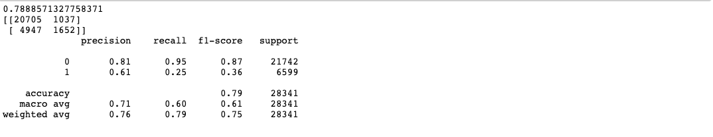
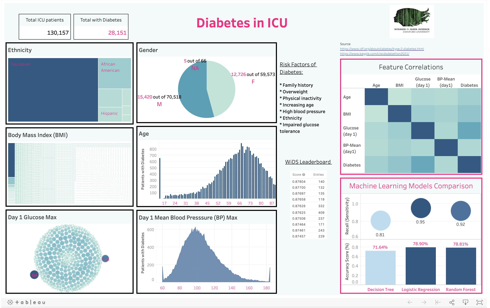

# Diabetes in ICUs

## Topic:
To determine whether a patient admitted to an ICU has been diagnosed with a particular type of diabetes, Diabetes Mellitus using data from the first 24 hours of intensive care.

## Reason Selecting Topic:
We came across the WiDS Datathon, which stands for Women in Data Science Datathon. They strive to inspire women worldwide to learn more about data science and provide a platform for women to connect and share their interests in a supportive community.

This year, they are focusing on patient health with the chronic condition of diabetes. They are doing this challenge to predict if a patient admitted to an ICU has been diagnosed with Diabetes Mellitus. The Intensive Care Units (ICUs) need the medical histories for incoming patients to give the right treatment, and an unconscious patient may not be able to provide such information. 

We decided to take on this project from [Kaggle](https://www.kaggle.com/c/widsdatathon2021/).

## Description of Data Sources: 
Data Source:
- TrainingWiDS2021.csv
- DataDictionaryWiDS2021.csv 
- APACHE_comorbidity.csv
- demographics.csv
- labs.csv
- vitals.csv

For this analysis, we used the TrainingWiDS2021.csv and the DataDictionaryWiDS2021.csv from the WiDS Datathon dataset. 

We used TrainingWiDS2021.csv to populate the database and DataDictionaryWiDS2021.csv for the description of information about the data. 

We sorted the TrainingWiDS2021.csv into 4 other dataset into APACHE_comorbidity.csv, demographics.csv, labs.csv, and vitals.csv. 

The APACHE_comorbidity.csv contains data of the APACHE comorbidity. 

The demographics.csv contains the demographics of the patient. 

The labs.csv contains the data of the lab results and the vitals.csv contains the data of the patient's vitals.

Software: 
- Python 3.9
- Jupyter Notebook 6.1.4
- SQLiteStudio
- Tableau

## Hypothesis:

Null Hypothesis: 
Patients admitted to an ICU has been diagnosed with Diabetes Mellitus

Alternative Hypothesis: 
Patients admitted to an ICU has not been diagnosed with Diabetes Mellitus.

## Questions they hope to answer with the data:

1. What features from the dataset are related to risk factors for patients diagnosed with Diabetes Mellitus?
2. Which feature(s) used for the machine learning models show the highest correlation to Diabetes Mellitus?
3. Which machine learning model has the highest accuracy and/or sensitivity to predict future cases of Diabetes Mellitus in ICUs?
4. What other information (ie., relationships) between the features or risk factors and Diabetes Mellitus can we learn from this dataset?

## Database:

 After deciding on the features to use, we selected the relevant data from the Kaggle dataset to create a static sqlite database file using SQLite Studio. 

 Four tables were identified based on the categories in the data dictionary file (demographics, vitals, labs and Apache comorbidity).  

 An ERD (diabetes_db_erd.png) was created initially to view the database schema. 

 

 The data from the original dataset was split into four csv files to load to the tables. 

 

 The tables are joined via the unique Encounter_ID column as the primary key, included in the query.sql file. 
 

 The database is connected to the model using SQLAlchemy.

## Machine Learning Model:

### Preliminary Data Preprocessing: 
The dataset has a total of 180 columns and 130,157 rows. Many of the values are missing or filled with NA. We decided to remove all missing values and be left with a dataset that is a little smaller. The cleaned dataset will have all values of the features to successfully train and test the models. 

### Description of preliminary feature engineering and preliminary feature selection, including their decision-making process: 
Through our research, we were able to see the major risk factors of Diabetes Mellitus which include family history, being overweight, physical inactivity, age, ethnicity, high blood pressure, impaired glucose tolerance. To find the corresponding variables in the dataset, we have chosen 'age', 'bmi', 'ethnicity', 'gender', 'height', 'weight', 'd1_glucose_max', 'd1_mbp_max' to be the features. In addition to finding out whether a patient in the ICU might have diabetes mellitus, we included features of comorbidity. This is the simultaneous presence of two or more diseases or medical conditions in a patient. These features are included in our dataset as 'aids', 'cirrhosis', 'hepatic_failure', 'immunosuppression', 'leukemia', 'lymphoma', and 'solid_tumor_with_metastasis'.

### Description of how data was split into training and testing sets:
Dataset is split into 75% training and 25% testing. 

### Explanation of model choice, including limitations and benefits:
Since our main goal is to classify a patient with diabetes mellitus or no diabetes mellitus, the initial approach was a mock model with Logistic Regression. After splitting the dataset into 75% training and 25% testing, the accuracy score is 78.90%. Then we tested the dataset with a decision tree model and the random forest model. Both models earned an accuracy score of 71.63% and respectively 78.81%.

#### Logistic Regression Model Classification:

#### Decision Tree Model Classification:

#### Random Forest Model Classification:

Overall, the logistic regression model is the best model for this project with a sensitivity (recall) rate of 0.95 whereas the decision tree model scored 0.81 and random forest model scored 0.92. Due to the nature of our problem, it is better to have a higher sensitivity so it can detect everyone who might have diabetes mellitus even if it means a certain number of false positive than to miss people who do have diabetes. Afterall, those with a positive result can undergo more testing to confirm or rule out diabetes. 

There are limitations to using a logistic regression model, it is the assumption that the dataset has features that are linearly separable. If we were to add more features into training this model, this can lead to the model being over fit on the training and predicting inaccurate results on the testing set.

### Description of how they have trained the model thus far, and any additional training that will take place:
So far the three models are trained with the cleaned encoded dataset with 113,363 rows and 22 columns of data. This is then split into 75% training and 25% testing. The model with the best accuracy and sensitivity rate is the logistic regression model. To make this model better, additional training might need to be done to improve accuracy. Since the dataset is so large with many features, we can scale the features in our dataset by converting all numerical data which are present in wide range into the same scale. 

### Re-trained model’s confusion matrix and final accuracy score:
After scaling the the x_train and x_test portion of our dataset, the final accuracy score for the logistic model is 78.90% which is the same as the original model. The sensitivity rate did not change remaining at 0.95. In conclusion, we thought that converting the numerical data to the same range would make a difference in the model’s performance. However, this was not the case. See below for the retrain model’s classification report. 

### Conclusion:
The logistic model built is capable of predicting ICU patients with diabetes mellitus correctly at a rate of 78%. In our correlation heat map, we were able to pick out features that are risk factors of diabetes. The heat map showed the percentage of correlation these features have to diabetes mellitus. The feature with the highest correlation of 40% was the patients day 1 glucose max rate, followed by body mass index and weight. In addition, we included chronic conditions in our features selection to test if the simultaneous presence of two or more diseases or medical conditions will increase an ICU patients chances of having diabetes mellitus. Surprisingly, the correlation of a chronic medical condition to diabetes is relatively low.

## Dashboard:

For the dashboard, we used Tableau to create graphs of the individual features to show the relationships in the data.  There is a total # of ICU patients and patients with diabetes as the subset. For the features, we created a treemap of ethnicity, a pie chart of gender, a treemap of BMI, a bar graph of age, a circle graph of Day 1 glucose max and an area graph of Day 1 mean blood pressure. These graphs of the features are interactive and shows how individual features are related to each other.  From the data, you can see the disproportionate ethnicity group of Caucasions, an indication of data bias. When toggling through the ethnicities, there are slight differences for each feature between each ethnicities.  

The link to our [Tableau Dashboard](https://public.tableau.com/profile/elaine.hm#!/vizhome/DiabetesPredictionsinICUs_16151380753230/DiabetesPredictorsinICU?publish=yes).

## Presentation:
Attached is our [Google Slide Presentation](https://docs.google.com/presentation/d/1SHAZMGU8j-jV8phY3CD1I5t1VpVGjprBJdyDsmeiYfk/edit#slide=id.gc3e862a1f2_0_36).

## Recommendations for Future Analysis:
- Reduce bias in dataset
- Consider additional features without overfitting
- Run additional testing with existing models
- Compare results with deep neural network models
- Use other complex models (ex., XGBoost)

In our dashboard there is a chart showing the 3 model’s accuracy score. There is an additional re-trained Logistic Model #2 (a 4th accuracy score) showing the new re-trained Logistic model’s accuracy score with 0 increase/decrease in percentage. We re-trained the model by scaling our features. This did not do much for our model and we recommend that for future analysis, we should include more specific features such as ethnicity to normalize the disproportionate distribution in our dataset. Another recommendation would be to run additional tests and to try out a different classification models. 

## Individual Branches:
Square: Carmen Low: CL

Triangle: Sydney Chen: SC_model, and SC_readme

Circle: Elaine Martinez: EHM_db, EHM_db2, and EHM_db3

